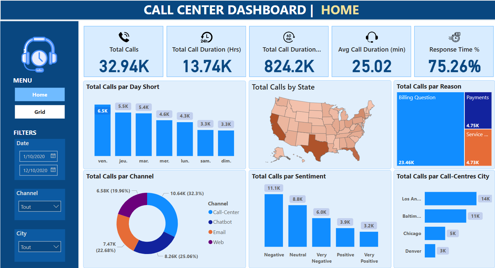
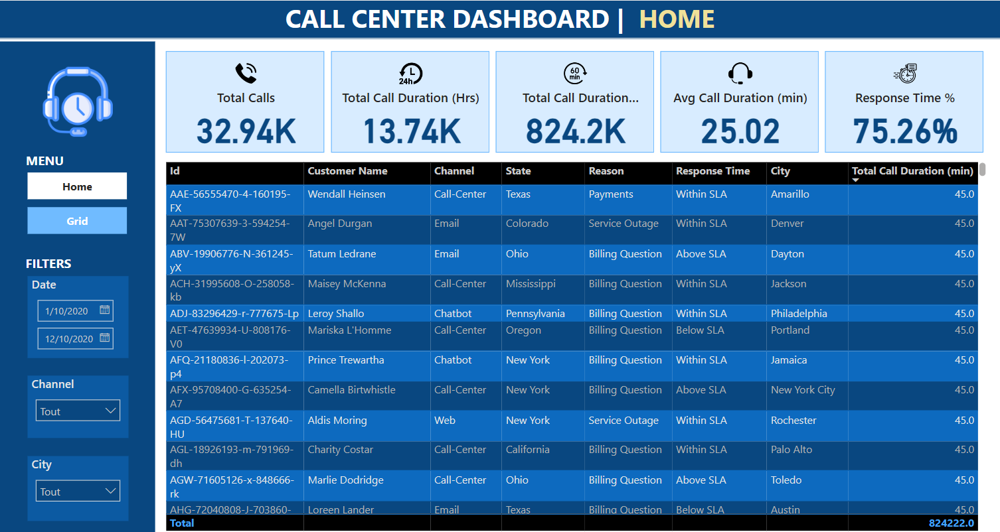

# INTRODUCTION
This project focuses on creating a comprehensive Power BI dashboard to analyze key performance indicators (KPIs) for a call center. The goal is to visualize important metrics related to call center operations, including the number of calls, call duration, and response times, to help improve efficiency and service quality.

Purpose:
The dashboard will allow call center managers to monitor performance trends, resource allocation, and customer satisfaction. The visualization of key metrics will aid in identifying areas for improvement and making data-driven decisions

**KPI'S REQUIREMENT**

* 1. Total Number of Calls: We need to track and display the total number of calls received by our  call center over a specified period.

* 2. Total Call Duration in Hours: It is crutial to understand the total amount of time our call center staff spends on calls in hours, which can help us in ressource allocation and capacity planning.

* 3. Total Call Duration in Minutes: Similar to the total call duration in hours, this KPI provides the total call time but in minutes, offering a more granular view of call duration 

* 4. Average Call Duration in Minutes: To access the efficiency of our agents, we need to calculate and display the average call duration in minutes. This metric can help identify trends in call handling 

* 5. Response Time Percentage : 
Response time is a crutical factor in customer satisfaction. This KPI should display the percentage of calls answered  within a predefined time frame, helpingus gauge  our ability to provide prompt service.

**CHART'S REQUIREMENT**
* 1. Total Call by Day (Column Chart): Display a column chart that shows the total number of call on each day over a specified time period.
* 2. Total Call by State (Filled Map Chart): Create a filled map chart that visualizes the total number of call received from different states or regions.
* 3. Top Reason for Calls (Tree Map): Implement a tree map chart to display the top reasons for  calls. Each box in tree map represents a call reason.
* 4. Total Calls by Channel (Donut Chart): Create a donut chart to showcase the distribution of calls by different communication channels.
* 5. Total Calls by Sentiment (Column Chart): Utilize a column chart to illustrate the distribution of calls by sentiment (Positive, negative, neutral)
* 6. Total Calls by call center (Bar Chart):
Create a bar chart that presents the total number of calls handled by each call center or department.

# SCREENSHOTS
**HOME**

**GRID**
